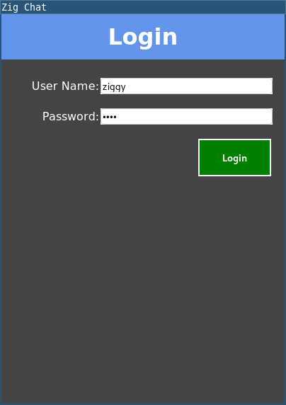
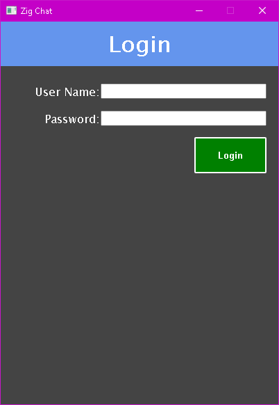

# ⚛️ Positron


A Zig binding to the [webview](https://github.com/webview/webview) library. Make Zig applications with a nice HTML5 frontend a reality!

 

## Usage

```zig
//! src/minimal.zig

const std = @import("std");
const wv = @import("positron");

pub fn main() !void {
    const view = try wv.View.create(false, null);
    defer view.destroy();

    view.setTitle("Webview Example");
    view.setSize(480, 320, .none);

    view.navigate("https://ziglang.org");
    view.run();
}
```

```zig
//! build.zig

const std = @import("std");
const pkgs = @import(".zpm/pkgs.zig");
const Sdk = @import("Sdk.zig");

pub fn build(b: *std.build.Builder) void {
    const target = b.standardTargetOptions(.{});
    const mode = b.standardReleaseOptions();

    const exe = b.addExecutable("demo", "src/minimal.zig");
    exe.setTarget(target);
    exe.setBuildMode(mode);

    // Add and link the package.
    exe.addPackage(Sdk.getPackage("positron"));
    Sdk.linkPositron(exe, null);

    exe.install();
}
```

## Example

The example is a small, two-view chat application that transfers data bidirectionally between backend and frontend.

Log in with `ziggy`/`love` and you can send messages, no real server there though!

You can build the example with `zig build` and run it with `zig build run`.

## Building

### Linux

Install `gtk-3` and `webkit2gtk`, then invoke `zig build`.

### Windows

Download [Edge Dev Channel](https://www.microsoftedgeinsider.com/download), then invoke `zig build`.

### MacOS

No research was done for the support on MacOS. Try with `zig build`.

## Contributing

This library is in a early state and is very WIP. Still, feel free to contribute with PRs, or use it. Just don't assume a stable API.